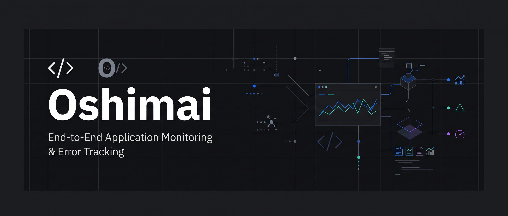
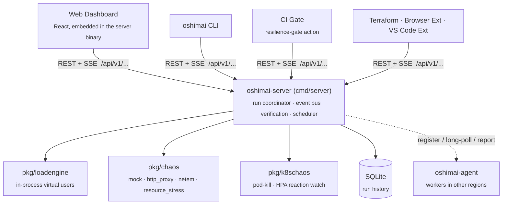

# Oshimai



**Autonomous Chaos & Load-Testing Twin.**

[](go.mod)
[](LICENSE)
[](#configuration)

Oshimai is a self-hosted control plane for load testing and chaos engineering that doesn't just run the profile you hand it — it searches for the answers you actually want: the exact concurrency your service can safely handle, the minimum fault severity that breaks it, and whether your target even belongs to you in the first place. It ships as a single Go binary with an embedded React dashboard, a scriptable CLI, and a REST/SSE API that every client — dashboard, CLI, CI gate, Terraform, browser extension, VS Code — speaks against.

```bash
oshimai run -scenario ./examples/scenario_ecommerce.yaml -vus 20 -duration 15s
```

**Contents:** [Why Oshimai](#why-oshimai) · [Architecture](#architecture) · [Quick start](#quick-start) · [CLI](#cli-reference) · [Scenarios](#writing-scenarios) · [Chaos drivers](#chaos-drivers) · [CI integration](#ci-integration) · [Configuration](#configuration) · [Project layout](#project-layout) · [Testing](#testing) · [Safety](#safety)

## Why Oshimai

Most load/chaos tools (k6, Gatling, Locust, JMeter, Chaos Mesh, Gremlin) execute exactly the profile an operator gives them, and it's on the operator to guess good parameters and eyeball whether the result "looks okay." Oshimai automates that judgment:

- **Auto-Pilot** — bisects virtual-user count to find the exact safe concurrency ceiling, instead of you guessing a VU number.
- **Auto Chaos Fuzzer** — bisects a single fault-severity scalar to find the minimum injected latency/loss/corruption that first breaks your health score, instead of you guessing fault parameters.
- **Target-ownership verification** — a DNS TXT / `.well-known` challenge (or AWS IP-allocation proof via `verify-cloud`) must pass before a public target can be load- or chaos-tested, the same way a CA validates domain ownership before issuing a TLS certificate. This closes the "booter-as-a-service" abuse vector most tools leave to a ToS disclaimer.
- **Guarded production approval** — any run labeled `environment=production` is held for a second operator's sign-off before it executes.
- **AI incident narration** — cross-references a run's diagnostics, a static resiliency scan of your repo, and a traffic-mined dependency graph into one coherent narrative, instead of leaving you to notice on your own that P99 spiked *and* `http.Client` has no timeout *and* the failing endpoint calls two other services with no circuit breaker.
- **Cultural load presets** — traffic shapes calibrated against real Indonesian events (Harbolnas/12.12 flash sales, payday-25 rush, mudik exodus) instead of generic ramp-up/hold/ramp-down curves, plus Indonesian mobile-carrier network profiles for the chaos engine.
- **Cross-customer benchmarking** — "your API is faster than 73% of similar e-commerce APIs tested this month," a network-effect feature no other load-testing tool offers because none of them aggregate results across deployments.
- **Kubernetes-native chaos** — pod-kill by label selector and closed-loop HPA reaction-time verdicts, built on plain REST+JSON against the k8s API server (no `client-go` dependency tree).
- **Multi-region agents** — fan a run out across `oshimai-agent` workers in different regions and merge the results for real geographic latency data.

## Architecture



Everything — the dashboard, the CLI, the [GitHub Action](.github/actions/resilience-gate), the [Terraform provider](tools/terraform-provider-oshimai), the [browser extension](tools/browser-extension), and the [VS Code extension](tools/vscode-extension) — is a thin client over the same control-plane REST/SSE API (`pkg/server`). Run history persists to a SQLite database file next to the `oshimai-server` binary by default (see [Configuration](#configuration)), so it survives a restart without any external database to stand up.

## Quick start

Prebuilt binaries for Windows, Linux, and macOS (amd64 and arm64) are available on the [Releases page](https://github.com/HoshizoraAkira/Oshimai/releases) — download, extract, and skip straight to `./oshimai-server -addr :8080`. To build from source instead:

**Prerequisites:** Go 1.27+, Node.js 18+.

> **Note:** `pkg/server` embeds the dashboard at compile time via `//go:embed all:dist` (see [`web/embed.go`](web/embed.go)). `web/dist` is a generated build artifact and is **not** committed to the repo, so the frontend must be built once *before* `./cmd/server` will compile — on a fresh clone, `go build ./...` fails until you've run `npm run build` in `web/` at least once.

```bash
git clone <this-repo-url> oshimai
cd oshimai
cp .env.example .env        # optional: add your own BYNARA_API_KEY to enable AI features

# 1. Build the dashboard (required once — cmd/server won't compile without web/dist)
cd web && npm install && npm run build && cd ..

# 2. Build the Go binaries
go build -o bin/oshimai-server ./cmd/server
go build -o bin/oshimai        ./cmd/cli

./bin/oshimai-server -addr :8080
```

Or with `make` (does the same two steps):

```bash
make build
./bin/oshimai-server -addr :8080
```

Open `http://localhost:8080` for the dashboard, or drive it from the CLI:

```bash
./bin/oshimai run -scenario ./examples/scenario_ecommerce.yaml -vus 20 -duration 15s
./bin/oshimai list -limit 10
./bin/oshimai status -id run-1699999999-1
```

Once built, the server binary is fully self-contained — you only need Node.js again if you change something under `web/`. While iterating on the frontend, run `npm run dev` (in `web/`) for a hot-reloading dev server on `:5173` instead of rebuilding on every change; it proxies API calls to a separately running `oshimai-server`.

## CLI reference

`oshimai` is a thin client over the same REST API the dashboard uses — 19 commands covering runs, verification, chaos bisection, Kubernetes fault injection, multi-region fan-out, and more. See **[docs/cli.md](docs/cli.md)** for the full command table, usage examples, and the target-verification workflow. Run `oshimai help` for the flag list per command.

## Writing scenarios

A scenario is a YAML state machine of HTTP steps with variable extraction, probabilistic (Markov-style) transitions, and assertions. See **[docs/scenarios.md](docs/scenarios.md)** for the full DSL reference, or generate one instead of hand-writing it:

```bash
oshimai generate -openapi ./api.json -base-url https://staging.example.com   # from an OpenAPI spec
oshimai import -format har -file ./recording.har -out ./scenario.yaml       # from a browser recording
```

The [browser extension](tools/browser-extension) records a click-through session and exports it as a scenario directly; the [VS Code extension](tools/vscode-extension) runs a scenario file from the editor.

## Chaos drivers

Set with `-chaos-driver` on `oshimai-server`:

| Driver | Requirements | Notes |
|---|---|---|
| `mock` | none | Safe default — simulates faults with no side effects |
| `http_proxy` | none | No-root userspace proxy, works on any OS |
| `netem` | Linux + `NET_ADMIN` | Real network-level fault injection via `tc netem` |
| `resource_stress` | none | CPU/memory/disk pressure on the host running the server |

Every driver is wrapped with a dead-man-switch (`ManagedChaosDriver`) that guarantees faults are reverted even if a run is aborted or crashes mid-flight. See **[docs/chaos.md](docs/chaos.md)** for fault parameters and Kubernetes-native chaos (pod-kill, HPA reaction-time verdicts).

## CI integration

The [`resilience-gate` composite action](.github/actions/resilience-gate) runs a scenario against a target, fails the job if the resulting health score drops below a threshold (or regresses against a baseline run), and posts the verdict as a PR comment. See [`.github/workflows/resilience-gate-example.yml`](.github/workflows/resilience-gate-example.yml) for a runnable template — copy it into your own repo and point `target-base-url` / `scenario-path` at your staging deployment.

## Configuration

Copy [`.env.example`](.env.example) to `.env` (auto-loaded on server start; real environment variables always take precedence):

| Variable | Default | Purpose |
|---|---|---|
| `BYNARA_API_KEY` | — | Enables AI features (natural-language scenario generation, incident narration) via [Bynara AI](https://bynara.id) |
| `BYNARA_MODEL` | `mistral-medium-3-5` | Model used for AI features |
| `SERVER_ADDR` | `:8080` | Listen address |
| `MAX_RUNS` | `2` | Maximum concurrent load test runs |
| `CHAOS_DRIVER` | `mock` | Default fault-injection driver |
| `DB_PATH` | `oshimai.db` next to the server binary | SQLite database file for run history. Set to `:memory:` for a non-persistent store. |

The equivalent server flags (`-addr`, `-max-runs`, `-chaos-driver`, `-db`) take precedence over these environment variables. `-enforce-target-verification` and `-require-production-approval` are command-line-only by design — they default to the safe/strict setting and deliberately have no environment-variable override, so a shared `.env` file can't silently disable a safety control.

## Project layout

```
cmd/server/     control-plane HTTP/SSE API server
cmd/cli/        oshimai CLI — a thin client over the server's REST API
cmd/agent/      oshimai-agent — multi-region load-generation worker
pkg/            21 subsystem packages: loadengine, chaos, k8schaos, vusession,
                verify, cloudverify, generator, narrator, remediation, scanner,
                autofuzz, autopilot, search, presets, benchmark, scheduler,
                server, i18n, dotenv, ...
web/            React + TypeScript + Vite dashboard, embedded into the server binary
examples/       sample scenario files
docs/           CLI reference and other usage guides
tools/          terraform-provider-oshimai, browser-extension, vscode-extension
                (each is its own standalone project — see their own READMEs)
```

Most `pkg/` packages open with a doc comment explaining not just what they do but *why* — worth reading directly (e.g. [`pkg/autofuzz`](pkg/autofuzz), [`pkg/verify`](pkg/verify), [`pkg/k8schaos`](pkg/k8schaos)) if you want the design rationale behind a subsystem.

## Testing

```bash
make build && make test   # build web/dist first, then run both test suites

# equivalent, by hand:
cd web && npm install && npm run build && npm run typecheck && cd ..
go vet ./...
go test ./...
```

`go build ./...` / `go test ./...` on their own only work once `web/dist` already exists (see the [Quick start](#quick-start) note) — `make build` handles that ordering for you.

## Safety

Oshimai is built to inject real faults and drive real load against real services — used carelessly, it can take down something you don't own or didn't mean to. Target-ownership verification and guarded-production approval are on by default; don't disable them unless you understand exactly what you're opting out of, and only ever point Oshimai at infrastructure you have explicit authorization to test. See **[docs/verification.md](docs/verification.md)** for how both gates work and how to complete target verification.

## Contributing

Issues and pull requests are welcome. Please run `go test ./...` and `npm run typecheck` (in `web/`) before submitting.

## License

Licensed under the [Apache License 2.0](LICENSE).
